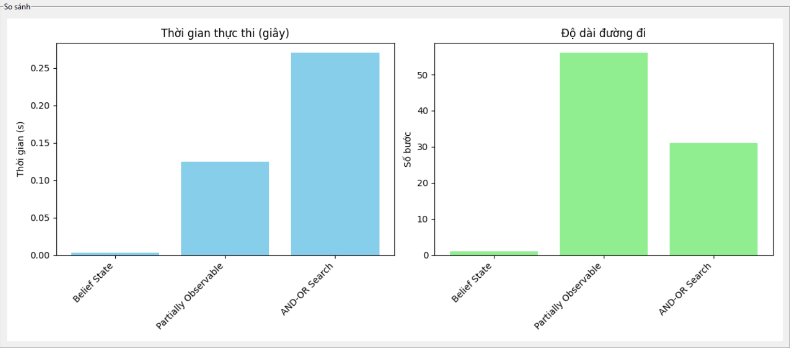

# Trí Tuệ Nhân Tạo - Đồ Án Cá Nhân
# Thuật Toán Tìm Kiếm Trong AI & Ứng Dụng Giải Trò Chơi 8-Puzzle

**Bài tập Cá nhân môn Trí Tuệ Nhân Tạo (AI)**
**Huỳnh Thanh Nhân - 23110280**

## Tổng Quan Đề Tài

Dự án này tập trung vào việc cài đặt và so sánh hiệu suất của các thuật toán tìm kiếm trong trí tuệ nhân tạo, sử dụng bài toán 8-Puzzle làm trường hợp thử nghiệm. Bài toán 8-Puzzle là một trò chơi đơn giản nhưng hiệu quả để minh họa nguyên lý hoạt động của các thuật toán tìm kiếm.

Các thuật toán được triển khai trong dự án này được phân thành 6 nhóm chính:
- Thuật toán tìm kiếm mù (Uninformed Search)
- Thuật toán tìm kiếm có thông tin (Informed Search)
- Thuật toán leo đồi và biến thể, di truyền (Local Search)
- Thuật toán dựa trên ràng buộc (CSPs)
- Thuật toán tìm kiếm trong môi trường phức tạp (Complex Environment)
- Thuật toán học tăng cường (Reinforcement Learning)

Dự án cung cấp một giao diện trực quan, cho phép người dùng theo dõi quá trình tìm kiếm lời giải theo từng bước, giúp hiểu rõ hơn về cơ chế hoạt động của mỗi thuật toán.

## Mục Lục

1. [Tổng Quan Đề Tài](#tổng-quan-đề-tài)
2. [Mục Lục](#mục-lục)
3. [Nhóm Thuật Toán Tìm Kiếm Mù (Uninformed Search)](#nhóm-thuật-toán-tìm-kiếm-mù-uninformed-search)
   - [Breadth-First Search (BFS)](#breadth-first-search-bfs)
   - [Depth-First Search (DFS)](#depth-first-search-dfs)
   - [Iterative Deepening DFS](#iterative-deepening-dfs)
   - [Uniform Cost Search](#uniform-cost-search)
4. [Nhóm Thuật Toán Tìm Kiếm Có Thông Tin (Informed Search)](#nhóm-thuật-toán-tìm-kiếm-có-thông-tin-informed-search)
   - [Greedy Search](#greedy-search)
   - [A* Search](#a-search) 
   - [IDA* Search](#ida-search)
5. [Nhóm Thuật Toán Tìm Kiếm Cục Bộ (Local Search)](#nhóm-thuật-toán-tìm-kiếm-cục-bộ-local-search)
   - [Simple Hill Climbing](#simple-hill-climbing)
   - [Steepest Hill Climbing](#steepest-hill-climbing)
   - [Beam Search Hill Climbing](#beam-search-hill-climbing)
   - [Stochastic Hill Climbing](#stochastic-hill-climbing)
   - [Simulated Annealing](#simulated-annealing)
   - [Genetic Algorithm](#genetic-algorithm)
6. [Nhóm Thuật Toán Dựa Trên Ràng Buộc (CSPs)](#nhóm-thuật-toán-dựa-trên-ràng-buộc-csps)
   - [Backtracking Search](#backtracking-search)
   - [Forward Checking Search](#forward-checking-search)
   - [Min-Conflicts Search](#min-conflicts-search)
7. [Nhóm Thuật Toán Tìm Kiếm Trong Môi Trường Phức Tạp (Complex Environment)](#nhóm-thuật-toán-tìm-kiếm-trong-môi-trường-phức-tạp-complex-environment)
   - [Belief State Search](#belief-state-search)
   - [AND-OR Search](#and-or-search)
   - [Partially Observable Search](#partially-observable-search)
8. [Thuật Toán Học Tăng Cường (Reinforcement Learning)](#thuật-toán-học-tăng-cường-reinforcement-learning)
   - [Q-Learning](#q-learning)
9. [Tổng Kết ](#tổng-kết)

## Nhóm Thuật Toán Tìm Kiếm Mù (Uninformed Search)

Thuật toán tìm kiếm mù là các thuật toán không sử dụng thông tin đặc biệt nào về mục tiêu để định hướng quá trình tìm kiếm, ngoài việc xác định trạng thái mục tiêu.

### Breadth-First Search (BFS)

[Link tới mã nguồn](Do_an_ca_nhan.py#L63-L95)BFS khám phá không gian trạng thái theo chiều rộng, đảm bảo tìm được đường đi ngắn nhất (về số bước) từ trạng thái ban đầu đến trạng thái đích.

*Ưu điểm:* tìm được lời giải ngắn nhất (ít bước nhất) nếu chi phí các bước là như nhau.

**Độ phức tạp:**
- Thời gian: O(b^d) với b là số nhánh trung bình và d là độ sâu của giải pháp
- Không gian: O(b^d)

### Depth-First Search (DFS)

[Link tới mã nguồn](Do_an_ca_nhan.py#L126-L163)DFS khám phá không gian trạng thái theo chiều sâu, tìm hiểu hết một nhánh trước khi quay lại và khám phá các nhánh khác.

**Độ phức tạp:**
- Thời gian: O(b^m) với b là số nhánh trung bình và m là độ sâu tối đa 
- Không gian: O(b*m)

### Iterative Deepening DFS

[Link tới mã nguồn](Do_an_ca_nhan.py#L164-L209)IDDFS kết hợp ưu điểm của BFS và DFS bằng cách thực hiện DFS với giới hạn độ sâu tăng dần.
Kết hợp lợi ích của tính năng tìm kiếm
nhanh của tìm kiếm theo chiều rộng và
tính hiệu quả bộ nhớ của tìm kiếm theo
chiều sâu
**Độ phức tạp:**
- Thời gian: O(b^d) 
- Không gian: O(b*d)

### Uniform Cost Search

[Link tới mã nguồn](Do_an_ca_nhan.py#L96-L125)UCS mở rộng các nút theo thứ tự chi phí tích lũy từ nút gốc, đảm bảo tìm được đường đi có chi phí thấp nhất.

**Thuận lợi:**

- Tối ưu vì ở mọi trạng thái, đường dẫn có chi phí thấp nhất sẽ được
chọn, hiệu quả khi trọng số cạnh nhỏ vì nó khám phá các đường dẫn theo thứ tự
đảm bảo tìm thấy đường dẫn ngắn nhất sớm.
- Đây là phương pháp tìm kiếm cơ bản, không quá phức tạp, dễ sử
dụng đối với nhiều người dùng.
- Thuật toán hoàn chỉnh, đảm bảo có thể tìm ra giải pháp bất cứ khi
nào có giải pháp khả thi.

**Nhược điểm:**

- Không quan tâm đến số bước liên quan đến tìm kiếm và chỉ quan
tâm đến chi phí đường dẫn, có thể bị kẹt trong vòng lặp vô hạn.

**Độ phức tạp:**
- Thời gian: O(b^(C*/ε)) với C* là chi phí của giải pháp tối ưu và ε là chi phí đơn vị nhỏ nhất
- Độ phức tạp thời gian trường hợp xấu nhất của tìm kiếm chi
phí thống nhất là O(b^(1 + [C*/ε]) )
- Không gian: O(b^(C*/ε))
- Độ phức tạp không gian trường hợp xấu nhất của tìm kiếm chi phí thống nhất là O(b^(1 + [C*/ε]) )

## Nhóm Thuật Toán Tìm Kiếm Có Thông Tin (Informed Search)

Thuật toán tìm kiếm có thông tin sử dụng các hàm heuristic để định hướng quá trình tìm kiếm, giúp giảm không gian tìm kiếm và tăng hiệu suất.
### Greedy Search

[Link tới mã nguồn](Do_an_ca_nhan.py#L232-L267)Greedy Search chỉ sử dụng hàm heuristic để đánh giá nút, luôn chọn nút có giá trị heuristic thấp nhất để mở rộng.
Không có tính đầy đủ do có khả năng tạo thành vòng lặp vô hạn ở một
số nút.

**Công thức:**  
f(n) = h(n)

**Độ phức tạp:**
- Thời gian: O(b^m) trong trường hợp xấu nhất
- Không gian: O(b^m)
- Thuật toán không tối ưu.

### A* Search

[Link tới mã nguồn](Do_an_ca_nhan.py#L268-L309)

Greedy Search không đảm bảo tìm ra đường đi ngắn nhất là do thuật toán
chỉ quan tâm tới chi phí ước lượng từ một nút tới đích mà không quan tâm
tới chi phí đã đi từ nút xuất phát tới nút đó.

A* kết hợp chi phí thực tế từ nút gốc đến nút hiện tại (g) với ước lượng chi phí từ nút hiện tại đến đích (h), tạo thành hàm đánh giá f = g + h.

**Công thức:**  
f(n) = g(n) + h(n)

Nơi:
- g(n) là chi phí thực từ nút gốc đến nút n
- h(n) là ước lượng chi phí từ nút n đến đích

Hàm heuristic h(n) được gọi là chấp nhận được khi: 
- h(n) ≤ h*(n)
– h*(n) là giá thành đường đi thực tế từ n đến node đích.
- hàm h(n)=0 với mọi n, là hàm chấp nhận được.

Các hàm heuristic:
- Được xây dựng tùy thuộc vào bài toán cụ thể.
- Có thể có rất nhiều hàm heuristic khác nhau cho cùng một loại bài toán.
- Chất lượng hàm heuristic ảnh hưởng rất nhiều đến quá trình tìm kiếm.
- Trong tất cả các thuật toán tìm kiếm tối ưu sử dụng cùng hàm heuristics
thì thuật toán A* có độ phức tạp tính toán nhỏ nhất, tức là yêu cầu sinh ra
ít nút nhất trước khi tìm ra lời giải.

**Độ phức tạp:**
- Thời gian: O(b^d) trong trường hợp xấu nhất
- Không gian: O(b^d)

### IDA* Search

[Link tới mã nguồn](Do_an_ca_nhan.py#L310-L390)IDA* kết hợp A* với ý tưởng tăng giới hạn độ sâu của IDDFS, giúp giảm yêu cầu bộ nhớ đáng kể.

**Độ phức tạp:**
- Thời gian: trường hợp xấu nhất O(b^d) với b: bậc phân nhánh (số trạng thái con/trạng thái), d: độ sâu lời giải tối ưu.
- Không gian: O(d)

## Nhóm Thuật Toán Tìm Kiếm Cục Bộ (Local Search)

Nhóm thuật toán này tập trung vào việc tối ưu hóa trạng thái hiện tại thay vì tìm kiếm toàn bộ không gian trạng thái, thích hợp cho các bài toán tối ưu hóa.

### Simple Hill Climbing

[Link tới mã nguồn](Do_an_ca_nhan.py#L486-L538)

- Là cách đơn giản nhất để triển khai thuật toán leo đồi
- Chỉ kiểm tra từng trạng thái lận cận của nó và nếu nó tìm thấy
trạng thái tốt hơn trạng thái hiện tại thì di chuyển

### Steepest Hill Climbing

[Link tới mã nguồn](Do_an_ca_nhan.py#L539-L600)

Steepest Hill Climbing xem xét tất cả các trạng thái kế tiếp và chọn trạng thái tốt nhất để di chuyển.

### Beam Search Hill Climbing

[Link tới mã nguồn](Do_an_ca_nhan.py#L601-L802)

Beam Search Hill Climbing duy trì một tập các trạng thái tốt nhất (beam width) thay vì chỉ một trạng thái duy nhất.

### Stochastic Hill Climbing 

[Link tới mã nguồn](Do_an_ca_nhan.py#L803-L861)

Stochastic Hill Climbing chọn ngẫu nhiên giữa các trạng thái kế tiếp tốt hơn với xác suất tỷ lệ thuận với mức độ cải thiện.

### Simulated Annealing

[Link tới mã nguồn](Do_an_ca_nhan.py#L862-L960)

Simulated Annealing cho phép chọn trạng thái kém hơn với xác suất giảm dần theo thời gian, giúp thoát khỏi cực đại địa phương.

**Công thức xác suất chấp nhận trạng thái kém hơn:**
P(ΔE, T) = exp(-ΔE/T)

Nơi:
- ΔE là sự khác biệt về giá trị đánh giá
- T là tham số nhiệt độ giảm dần theo thời gian

### Genetic Algorithm

[Link tới mã nguồn](Do_an_ca_nhan.py#L961-L1210)

Thuật toán di truyền mô phỏng quá trình tiến hóa tự nhiên, sử dụng các nguyên tắc chọn lọc tự nhiên, lai ghép, và đột biến để tìm lời giải.

**Các thành phần chính:**
- Biểu diễn cá thể
- Hàm thích nghi (fitness function)
- Chọn lọc (selection)
- Lai ghép (crossover)
- Đột biến (mutation)

**Công thức chọn lọc theo bánh xe roulette:**
P(i) = f(i) / Σf(j)

Nơi:
- f(i) là giá trị thích nghi của cá thể i
- Σf(j) là tổng giá trị thích nghi của quần thể

## Nhóm Thuật Toán Dựa Trên Ràng Buộc (CSPs)

Các thuật toán dựa trên ràng buộc (CSP) tập trung vào việc tìm giải pháp thỏa mãn một tập các ràng buộc. Để xem xét rõ hơn quá trình quay lui thì bạn hãy chọn Visualize CSP có sẵn trên giao diện để xem chi tiết (quá trình cũng hiển thị trên console).

### Backtracking Search

[Link tới mã nguồn](Do_an_ca_nhan.py#L1842-L1940)

Backtracking Search là thuật toán tìm kiếm đệ quy, gán giá trị cho biến và quay lui khi gặp xung đột.

### Forward Checking Search

[Link tới mã nguồn](Do_an_ca_nhan.py#L1941-L2041)

Forward Checking mở rộng Backtracking bằng cách xem trước các hạn chế tiềm ẩn, loại bỏ các giá trị không khả thi từ miền của các biến chưa gán.

### Min-Conflicts Search

[Link tới mã nguồn](Do_an_ca_nhan.py#L2042-L2208)

Min-Conflicts hoạt động bằng cách ngẫu nhiên gán giá trị ban đầu cho tất cả các biến, sau đó lặp đi lặp lại việc chọn một biến có xung đột và gán giá trị mới để giảm thiểu số xung đột.

### Q-Learning

[Link tới mã nguồn](Do_an_ca_nhan.py#L2209-L2461)

Q-Learning là một thuật toán học tăng cường không cần mô hình, học hàm giá trị Q để tối ưu hóa việc ra quyết định trong môi trường không xác định.

## Nhóm Thuật Toán Tìm Kiếm Trong Môi Trường Phức Tạp (Complex Environment)

Các thuật toán này giải quyết các vấn đề tìm kiếm trong môi trường không chắc chắn, không đầy đủ thông tin hoặc có tính ngẫu nhiên.

### Belief State Search

[Link tới mã nguồn](Do_an_ca_nhan.py#L1211-L1344)

Belief State Search tìm kiếm trong không gian trạng thái niềm tin, phù hợp với các môi trường không chắc chắn.

### AND-OR Search

[Link tới mã nguồn](Do_an_ca_nhan.py#L1478-L1554)

AND-OR Search giải quyết các vấn đề có các hoạt động không xác định, xây dựng một cây với các nút AND và OR.

### Partially Observable Search

[Link tới mã nguồn](Do_an_ca_nhan.py#L1555-L1841)

Partially Observable Search giải quyết các vấn đề trong môi trường mà các agent không có thông tin đầy đủ về trạng thái của hệ thống.

## Thuật Toán Học Tăng Cường (Reinforcement Learning)

Học tăng cường là một nhóm thuật toán trong đó agent học cách hành động trong môi trường để tối đa hóa phần thưởng tích lũy. Ở bài này do đã được học trước đó nên khi tìm lời giải sẽ có ngay lặp tức.

### Q-Learning

[Link tới mã nguồn](Do_an_ca_nhan.py#L2209-L2461)

Q-Learning là một thuật toán học tăng cường không cần mô hình, học hàm giá trị Q để tối ưu hóa việc ra quyết định trong môi trường không xác định.

**Công thức cập nhật giá trị Q:**
Q(s, a) = Q(s, a) + α * [r + γ * max(Q(s', a')) - Q(s, a)]

Nơi:
- s, a là trạng thái và hành động hiện tại
- s', a' là trạng thái và hành động tiếp theo
- r là phần thưởng tức thời
- α là tốc độ học
- γ là hệ số chiết khấu

## Tổng Kết 

Qua dự án này, chúng ta đã cài đặt và phân tích hiệu suất của 6 nhóm thuật toán tìm kiếm trong trí tuệ nhân tạo. Mỗi thuật toán đều có những ưu điểm và nhược điểm riêng, phù hợp với các loại vấn đề khác nhau.

